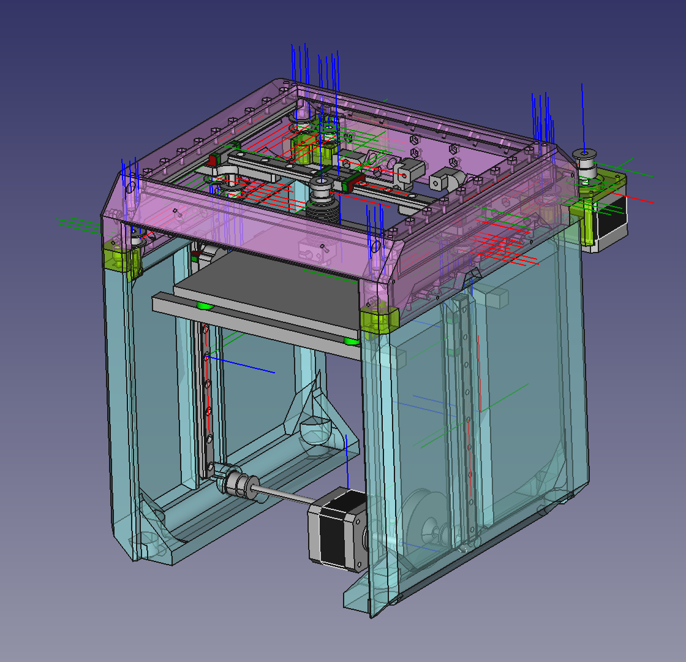

# CuriosiXY-mini

CriosiXY-mini is a 3D printer making with 3D printing.
The bed size is 150mm square.
It is designed around Core-XY kinematics and Belted-Z.

It's a work in progress and parts may interfere.

## License

Copyright (c) 2022 @marbocub <marbocub@gmail.com>, All rights reserved.

This program is distributed in the hope that it will be useful, but WITHOUT ANY WARRANTY; without even the implied warranty of MERCHANTABILITY or FITNESS FOR A PARTICULAR PURPOSE. 

This program is free software; you can redistribute it and/or modify it under the terms of the GNU General Public License version 3 as published by the Free Software Foundation, see LICENSE.
